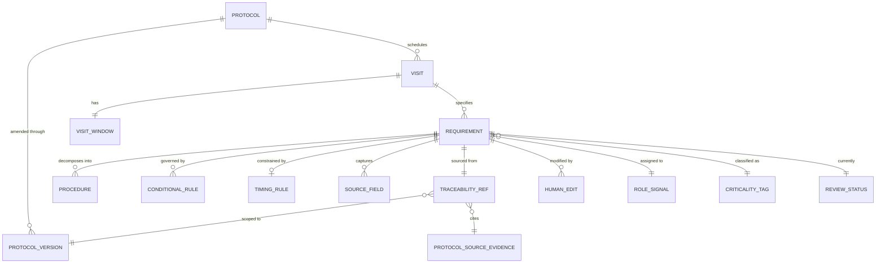

# Visit Execution Workspace — Canonical Protocol Logic Data Model

**Status:** Design doc. Awaiting Roger's schema review before any migration is written.
**Sprint:** 2 (formalizes the Sprint 1 mock fixture into a Postgres-backed canonical model).
**Branch:** `feat/visit-execution-canonical-schema-doc` (off `feat/visit-execution-workspace` / PR #119).
**Last updated:** 2026-05-26.

This doc is the canonical-schema input to Roger's review. Sprint 2.5 will write the actual migration once this design is agreed on.

---

## 1. What we already have

Two existing layers carry the protocol-derived data PIQC parses today:

**`protocol_visit_templates`** ([migration 20260507000000](../../supabase/migrations/20260507000000_protocol_visit_templates.sql)) — one row per parsed Schedule-of-Events entry per protocol document. Columns of interest:

| Column | Type | Sprint 2 role |
|---|---|---|
| `id` | UUID | the canonical Visit identity (we keep it) |
| `protocol_id` | UUID FK → `protocols.id` | scope key |
| `visit_name`, `study_day` | TEXT, INT | Visit base fields |
| `window_minus_days`, `window_plus_days` | INT | VisitWindow base fields |
| `procedures` | TEXT[] | flat strings today — **becomes the source of new structured rows** in Sprint 2.5 |
| `source_document_id` | UUID FK → `documents.id` | provenance |
| `cross_references` | JSONB `[{source_section, snippet, page, document_id}]` | unstructured "other places this visit is mentioned" — Sprint 2 elevates pieces of this into typed rules |
| `extracted_item_id` | UUID FK → `protocol_extracted_items.id` | already wires Visit ↔ SOTR provenance chain ([migration 20260508000000](../../supabase/migrations/20260508000000_sotr_schema.sql)) |

**`protocol_extracted_items`** ([migration 20260508000000](../../supabase/migrations/20260508000000_sotr_schema.sql)) — normalized SOTR worksheet items. Carries the review/draft pattern PIQC already uses: `version`, `review_status` (`'draft' | 'accepted_for_draft' | 'edited' | 'rejected_from_draft' | 'flagged'`), `current_text`, plus confidence + provenance + the [`worksheet_review_events`](../../supabase/migrations/20260508040000_sotr_draft_review_schema.sql) append-only log.

**Sprint 1's TypeScript types** ([`src/types/visit-execution/index.ts`](../../src/types/visit-execution/index.ts)) — Phase, Classification, ReviewStatus enums plus `VisitExecutionItem`, `VisitSnapshot`, `VisitExecutionWorkspace`, `ConditionalRule`, `AssessmentTimingConstraint`, `SourceFieldScaffold`, `VisitItemTraceability`. These are the contract the canonical schema must satisfy.

**The gap.** `procedures TEXT[]` cannot represent: phase ordering, classification, conditional rules, per-assessment timing, source-field scaffolds, item-level review state, role hints, or item-scoped traceability. Sprint 1's mock fixture provides these in memory; Sprint 2 backs them with tables.

---

## 2. Object model



Reading the diagram top-down: a **Protocol** has many **ProtocolVersions** (original + amendments). Each Protocol defines a fixed set of **Visits**. Each Visit has exactly one **VisitWindow** (the ± days the visit may slip) and many **Requirements**. A Requirement is the unit-of-execution-readiness: it is what the site coordinator reviews, marks done, edits, or flags. A Requirement may decompose into **Procedures** (sub-steps), may be governed by **ConditionalRules**, may carry one **TimingRule**, may scaffold **SourceFields** for the source-doc capture step, must have one **TraceabilityRef** back to the protocol, and may accumulate any number of **HumanEdits** over time.

**Founder's four Sprint 2 questions, answered here:**

1. *What object represents a visit requirement?* → **Requirement**, the canonical unit. Each parsed SoA procedure string becomes one or more Requirements after Sprint 3 enrichment. Visit-level metadata (window, purpose) stays on Visit; the action-level data lives on Requirement.

2. *How do SoA requirements and protocol body text requirements merge?* → Same table (`visit_requirements`), keyed by `(visit_id, ordinal)`. The `derived_from` enum column flags whether the row originated from the SoA cell, body-text section, footnote, or amendment. Multiple Requirements can share `(visit_id, ordinal_phase)` so a single SoA cell ("Labs") can decompose into multiple typed Procedures (Hematology, Chemistry, Coagulation).

3. *How do we represent footnotes and timing constraints?* → Footnotes that carry conditional logic become rows in `visit_conditional_rules`. Footnotes that carry timing become rows in `visit_timing_rules`. Footnotes that are pure contextual prose stay in `cross_references` JSONB as today.

4. *How do we keep protocol-derived fields locked while allowing site-specific edits?* → Same pattern as SOTR's `worksheet_review_events`: an append-only `visit_requirement_human_edits` table captures every change with reviewer_id, timestamp, before/after text, and reason. The base Requirement row keeps `derived_text` (parser output, immutable after ingest) separate from `current_text` (latest human-effective text). `derived_text` is never overwritten — `current_text` is what the UI shows.

---

## 3. Sprint 1 type → Postgres mapping

| Sprint 1 type | New Postgres home | Extends existing? | Notes |
|---|---|---|---|
| `VisitExecutionWorkspace` | derived view, not a table | — | composed by RPC at read time |
| `VisitSnapshot` | derived, fields computed from related tables | — | `is_dosing_visit`, `endpoint_critical_count`, etc. all derive |
| `VisitExecutionItem` | new `visit_requirements` | NO | the main new table; one row per requirement |
| `ConditionalRule` | new `visit_conditional_rules` | NO | FK to `visit_requirements` |
| `AssessmentTimingConstraint` | new `visit_timing_rules` | NO | 0-or-1 FK to `visit_requirements` |
| `SourceFieldScaffold` | new `visit_source_fields` | NO | FK to `visit_requirements` |
| `VisitItemTraceability` | columns on `visit_requirements` + FK to existing `protocol_extracted_items` | YES (reuses SOTR chain) | preserves the SOTR provenance chain — no new traceability tables needed |
| `ExecutionPhase` enum | new Postgres enum `execution_phase` | NO | mirror the TypeScript enum |
| `ItemClassification` enum | new Postgres enum `item_classification` | NO | mirror the TypeScript enum |
| `ExecutionReviewStatus` enum | new Postgres enum `execution_review_status` | NO | mirror the TypeScript enum |
| Human edit log | new `visit_requirement_human_edits` | NO (new table, established pattern) | copies the shape of `worksheet_review_events` |

The intentional design choice: **`procedures TEXT[]` on `protocol_visit_templates` is preserved**. It remains the raw-ingest signal. The new `visit_requirements` table is **derived from** the parsed array (after Sprint 3 enrichment) but does not replace it. This lets us re-run the parser without destroying human edits — edits live in a different table.

---

## 4. Proposed table schemas

These are **design proposals** in code blocks, not migrations. The actual migration file is written in Sprint 2.5 after Roger's review.

### 4.1 Enums

```sql
CREATE TYPE execution_phase AS ENUM (
  'pre_visit',
  'check_in',
  'assessment',
  'dosing',
  'post_dose',
  'safety_ae_conmed',
  'close_out'
);

CREATE TYPE item_classification AS ENUM (
  'required',
  'conditional',
  'if_applicable',
  'primary_endpoint',
  'secondary_endpoint',
  'safety_critical'
);

CREATE TYPE execution_review_status AS ENUM (
  'not_reviewed',
  'needs_review',
  'reviewed',
  'edited',
  'site_note_added'
);

CREATE TYPE requirement_origin AS ENUM (
  'soa_cell',         -- derived from a Schedule-of-Assessments cell
  'protocol_body',    -- derived from a body-text section
  'footnote',         -- derived from a footnote
  'amendment',        -- introduced by a protocol amendment
  'human_added'       -- site coordinator added (not protocol-derived)
);
```

### 4.2 `visit_requirements` — the new core table

```sql
CREATE TABLE visit_requirements (
  id                  UUID        PRIMARY KEY DEFAULT gen_random_uuid(),
  visit_template_id   UUID        NOT NULL REFERENCES protocol_visit_templates(id) ON DELETE CASCADE,
  ordinal             INTEGER     NOT NULL,
  phase               execution_phase     NOT NULL DEFAULT 'assessment',
  classification      item_classification NOT NULL DEFAULT 'required',
  origin              requirement_origin  NOT NULL DEFAULT 'soa_cell',

  -- Display text. derived_text is the parser output, frozen at ingest time.
  -- current_text takes precedence in the UI when non-null. Mirror of the
  -- protocol_extracted_items.current_text pattern.
  derived_text        TEXT        NOT NULL,
  current_text        TEXT,
  description         TEXT,

  role_hint           TEXT,
  has_source_fields   BOOLEAN     NOT NULL DEFAULT FALSE,

  -- Traceability — preserves the existing SOTR chain rather than duplicating.
  -- When extracted_item_id is non-null, the full source_evidence chain is reachable
  -- via protocol_item_evidence_links.
  extracted_item_id   UUID        REFERENCES protocol_extracted_items(id) ON DELETE SET NULL,
  protocol_section    TEXT,        -- e.g. "7.2.1 Vital Signs"
  protocol_page       INTEGER,
  soa_column          TEXT,        -- "V3" — column in the SoA table
  amendment_version   TEXT,

  -- Local review state — most-recent value. The full history lives in
  -- visit_requirement_human_edits.
  review_status       execution_review_status NOT NULL DEFAULT 'not_reviewed',
  review_note         TEXT,

  -- Version increments only on edit (mirrors protocol_extracted_items.version)
  version             INTEGER     NOT NULL DEFAULT 1,

  created_at          TIMESTAMPTZ NOT NULL DEFAULT NOW(),
  updated_at          TIMESTAMPTZ NOT NULL DEFAULT NOW(),

  UNIQUE (visit_template_id, ordinal)
);

CREATE INDEX visit_requirements_visit_idx
  ON visit_requirements(visit_template_id);
CREATE INDEX visit_requirements_phase_idx
  ON visit_requirements(visit_template_id, phase);
CREATE INDEX visit_requirements_extracted_item_idx
  ON visit_requirements(extracted_item_id)
  WHERE extracted_item_id IS NOT NULL;

-- RLS — scope through the existing protocol ownership chain.
ALTER TABLE visit_requirements ENABLE ROW LEVEL SECURITY;
CREATE POLICY "visit_requirements_owner"
  ON visit_requirements FOR ALL TO authenticated
  USING (
    visit_template_id IN (
      SELECT t.id
        FROM protocol_visit_templates t
        JOIN protocols p ON p.id = t.protocol_id
       WHERE p.owner_user_id = auth.uid()
          OR p.owner_org_id  IN (SELECT org_id FROM user_profiles WHERE user_id = auth.uid())
    )
  );

CREATE TRIGGER touch_visit_requirements_updated_at
  BEFORE UPDATE ON visit_requirements
  FOR EACH ROW EXECUTE FUNCTION audit_mode_touch_updated_at();
```

### 4.3 `visit_conditional_rules`

```sql
CREATE TABLE visit_conditional_rules (
  id                 UUID        PRIMARY KEY DEFAULT gen_random_uuid(),
  requirement_id     UUID        NOT NULL REFERENCES visit_requirements(id) ON DELETE CASCADE,
  ordinal            INTEGER     NOT NULL DEFAULT 0,
  condition_text     TEXT        NOT NULL,
  consequence_text   TEXT        NOT NULL,
  source_section     TEXT,
  source_page        INTEGER,
  created_at         TIMESTAMPTZ NOT NULL DEFAULT NOW()
);

CREATE INDEX visit_conditional_rules_req_idx
  ON visit_conditional_rules(requirement_id);

ALTER TABLE visit_conditional_rules ENABLE ROW LEVEL SECURITY;
CREATE POLICY "visit_conditional_rules_owner"
  ON visit_conditional_rules FOR ALL TO authenticated
  USING (
    requirement_id IN (
      SELECT r.id FROM visit_requirements r
      JOIN protocol_visit_templates t ON t.id = r.visit_template_id
      JOIN protocols p ON p.id = t.protocol_id
      WHERE p.owner_user_id = auth.uid()
         OR p.owner_org_id  IN (SELECT org_id FROM user_profiles WHERE user_id = auth.uid())
    )
  );
```

### 4.4 `visit_timing_rules`

Zero-or-one per requirement (the visit-level window stays on `protocol_visit_templates`; this is for finer per-procedure constraints like "PK sample within 30 min of dosing").

```sql
CREATE TABLE visit_timing_rules (
  id                       UUID        PRIMARY KEY DEFAULT gen_random_uuid(),
  requirement_id           UUID        NOT NULL UNIQUE REFERENCES visit_requirements(id) ON DELETE CASCADE,
  label                    TEXT        NOT NULL,
  window_before_minutes    INTEGER,
  window_after_minutes     INTEGER,
  is_hard_constraint       BOOLEAN     NOT NULL DEFAULT FALSE,
  source_section           TEXT,
  created_at               TIMESTAMPTZ NOT NULL DEFAULT NOW()
);
```

Same RLS pattern as 4.3.

### 4.5 `visit_source_fields`

```sql
CREATE TYPE source_field_type AS ENUM (
  'text', 'number', 'boolean', 'select', 'date'
);

CREATE TABLE visit_source_fields (
  id             UUID        PRIMARY KEY DEFAULT gen_random_uuid(),
  requirement_id UUID        NOT NULL REFERENCES visit_requirements(id) ON DELETE CASCADE,
  ordinal        INTEGER     NOT NULL DEFAULT 0,
  field_label    TEXT        NOT NULL,
  field_type     source_field_type NOT NULL DEFAULT 'text',
  units          TEXT,
  normal_range   TEXT,
  is_required    BOOLEAN     NOT NULL DEFAULT FALSE,
  created_at     TIMESTAMPTZ NOT NULL DEFAULT NOW()
);

CREATE INDEX visit_source_fields_req_idx
  ON visit_source_fields(requirement_id);
```

### 4.6 `visit_requirement_human_edits` — append-only audit log

Mirror of `worksheet_review_events` ([migration 20260508040000](../../supabase/migrations/20260508040000_sotr_draft_review_schema.sql)). The core idea: every state change to `visit_requirements.review_status` or `current_text` writes a row here. The row carries reviewer + version + text-before/after. The base table holds the latest state; this holds the full history.

```sql
CREATE TYPE visit_requirement_edit_action AS ENUM (
  'mark_reviewed',
  'unmark_reviewed',
  'edit_text',
  'add_site_note',
  'flag_for_review',
  'mark_needs_clarification'
);

CREATE TABLE visit_requirement_human_edits (
  id                   UUID        PRIMARY KEY DEFAULT gen_random_uuid(),
  requirement_id       UUID        NOT NULL REFERENCES visit_requirements(id) ON DELETE CASCADE,
  reviewer_id          UUID        NOT NULL REFERENCES auth.users(id),
  action               visit_requirement_edit_action NOT NULL,

  -- For edit_text. NULL for non-edit actions.
  previous_text        TEXT,
  new_text             TEXT,

  -- Site coordinator's free-text note (e.g. "site uses different lab kit"). Sensitive — never logged.
  reviewer_note        TEXT,

  -- Captured at moment of action.
  requirement_version  INTEGER     NOT NULL,
  protocol_id          UUID        NOT NULL REFERENCES protocols(id),
  amendment_version    TEXT,

  created_at           TIMESTAMPTZ NOT NULL DEFAULT NOW()
);

CREATE INDEX visit_requirement_human_edits_req_idx
  ON visit_requirement_human_edits(requirement_id, created_at DESC);
CREATE INDEX visit_requirement_human_edits_reviewer_idx
  ON visit_requirement_human_edits(reviewer_id, created_at DESC);

ALTER TABLE visit_requirement_human_edits ENABLE ROW LEVEL SECURITY;
CREATE POLICY "visit_requirement_human_edits_owner"
  ON visit_requirement_human_edits FOR ALL TO authenticated
  USING (
    requirement_id IN (
      SELECT r.id FROM visit_requirements r
      JOIN protocol_visit_templates t ON t.id = r.visit_template_id
      JOIN protocols p ON p.id = t.protocol_id
      WHERE p.owner_user_id = auth.uid()
         OR p.owner_org_id  IN (SELECT org_id FROM user_profiles WHERE user_id = auth.uid())
    )
  );
```

---

## 5. Parser-output mapping (Sprint 3 preview)

Today's [`CLINICAL_EXTRACT_SCHEMA`](../../supabase/functions/ingest/index.ts) (in the ingest function) returns `schedule_of_events[].procedures: string[]`. Sprint 3 will extend that to:

```jsonc
schedule_of_events: [{
  visit_name: string,
  study_day: number,
  window_minus_days: number,
  window_plus_days: number,
  procedures_structured: [{
    label: string,
    phase: 'pre_visit' | 'check_in' | 'assessment' | 'dosing' | 'post_dose' | 'safety_ae_conmed' | 'close_out',
    classification: 'required' | 'conditional' | 'if_applicable' | 'primary_endpoint' | 'secondary_endpoint' | 'safety_critical',
    conditions: [{ condition_text, consequence_text, source_section, source_page }],
    timing: { label, window_before_minutes?, window_after_minutes?, is_hard_constraint, source_section } | null,
    source_fields: [{ field_label, field_type, units?, normal_range?, is_required }],
    role_hint: string | null,
    soa_column: string | null,
    protocol_section: string | null,
    protocol_page: number | null,
  }],
  schedule_variant: string,
  cross_references: [...]   // unchanged
}]
```

The existing flat `procedures: string[]` stays in the schema for backward compatibility. The new `procedures_structured` array is what Sprint 3's ingest writes into `visit_requirements` rows (one per element).

This is additive only — no breaking change to existing ingest consumers.

---

## 6. Protocol-derived vs human-edited separation

Two mechanisms, working together:

**1. Two text columns on `visit_requirements`.**
- `derived_text` — frozen at ingest. Never modified by human action. Re-overwritten only by re-running the ingest (which gates on `version`).
- `current_text` — what the UI displays. Null when no human edit has occurred (UI falls back to `derived_text`). Set by the `edit_text` action.

**2. Append-only edit log: `visit_requirement_human_edits`.**
Every state change is captured. This is the audit trail. The base table is mutated for fast reads; the log is immutable for compliance.

**Re-ingest safety.** When a parser run re-emits the same Visit, the ingest RPC should:
1. Compare new `derived_text` against existing `derived_text`. If different and the requirement has a non-null `current_text`, log a warning event and DO NOT overwrite (the human edit is sticky).
2. If `current_text` is null, overwrite `derived_text` freely.
3. Emit a `requirement_drift` event somewhere for the reviewer to triage (TBD — could be a new table or just a system note).

This mirrors how SOTR handles re-ingest of `protocol_extracted_items` (`current_text` survives because the upsert merges instead of overwriting).

---

## 7. Traceability — preserve existing chain, don't duplicate

The Sprint 1 `VisitItemTraceability` type has these fields:

```typescript
soa_column, protocol_section, protocol_page, amendment_version,
source_evidence_id,
cross_reference_source_section, cross_reference_page, cross_reference_snippet
```

The first five become columns on `visit_requirements` directly (already shown in §4.2). The cross-reference fields **do not become columns** — they remain in `protocol_visit_templates.cross_references` JSONB at the **visit** level (already populated by the ingest pipeline; see [migration 20260508000100](../../supabase/migrations/20260508000100_visit_template_cross_references.sql)). The TraceabilityDrawer renders visit-level cross-references from `protocol_visit_templates.cross_references` and item-level provenance from `visit_requirements.{protocol_section, protocol_page, soa_column, extracted_item_id}`.

When `visit_requirements.extracted_item_id` is non-null, the existing chain reaches the source PDF:

```
visit_requirements.extracted_item_id
  → protocol_extracted_items.id
  → protocol_item_evidence_links.extracted_item_id
  → protocol_source_evidence.id  (page, section, bbox, quoted_text)
```

No new traceability tables are required. The SOTR provenance chain is the canonical source of "where in the PDF did this come from."

---

## 8. Protocol versioning

The founder vision lists `ProtocolVersion` as a separate object. Today PIQC has partial versioning:
- `protocols.version` / `protocols.protocol_number` — naming/identity at protocol-level
- `protocol_source_evidence.protocol_version` — version string captured at parse time
- `documents.extracted_fields.protocol_version` — version from the parsed PDF metadata

**Sprint 2 design call: do not introduce a separate `protocol_versions` table.** Instead, treat amendments as new `documents` rows linked to the same `protocols.id`, with `extracted_fields.is_amendment = true` and `extracted_fields.protocol_version` as the version string. The `visit_requirements.amendment_version` column captures which version introduced that specific requirement.

This sidesteps a schema-heavy change for an MVP scope. Sprint 7 ("amendment/version comparison" in the roadmap) is when proper amendment-diff semantics earn a dedicated table.

---

## 9. SoA + body-text + footnote merge strategy

Three input streams during Sprint 3 ingest, one output table.

**Per the founder's question:** *"How do SoA requirements and protocol body text requirements merge?"*

| Source | Becomes Requirement with… | `origin` enum |
|---|---|---|
| SoA cell ("Labs" at V3) | one row, decomposed by parser into sub-procedures (e.g. Hematology / Chemistry / Coagulation) — each gets its own Requirement row sharing `(visit_template_id, ordinal_phase)` | `'soa_cell'` |
| Protocol body paragraph that mandates an action ("PK samples must be drawn at every dosing visit") | one Requirement row at the relevant phase, ordinal placed by the parser | `'protocol_body'` |
| Footnote with conditional language ("If subject is of childbearing potential...") | the **footnote** creates a row in `visit_conditional_rules` linked to the existing parent Requirement (e.g. "Pregnancy test"). It does NOT create a new top-level Requirement. | n/a (no new requirement) |
| Footnote with timing language ("Must be drawn fasting") | creates a row in `visit_timing_rules` linked to the parent Requirement. | n/a |
| Footnote pure context ("See appendix B for kit handling") | stays in `cross_references` JSONB. Not elevated. | n/a |
| Protocol amendment introducing a new requirement | new `visit_requirements` row with `origin = 'amendment'` and the amendment's `protocol_version` | `'amendment'` |

The deduplication concern (an item mentioned both in SoA and body text):

- The parser computes a canonicalized fingerprint per item (visit + label + study_day-window).
- On ingest, the SoA pass writes first. The body-text pass enriches existing rows (adds `description`, attaches conditions/timing) rather than creating duplicates.
- If body text introduces an item with no SoA equivalent, it writes a new row with `origin = 'protocol_body'`.

The merge logic is owned by the ingest function in Sprint 3 — not by the schema. The schema is permissive (allows either origin in the same visit); the rules are enforced in the parser.

---

## 10. Migration sequence (Sprint 2.5 preview)

Proposed filenames, in order:

```
supabase/migrations/
  20260601000000_visit_execution_enums.sql              -- §4.1 enums
  20260601000100_visit_requirements_table.sql            -- §4.2 main table + indexes + RLS
  20260601000200_visit_conditional_rules_table.sql       -- §4.3
  20260601000300_visit_timing_rules_table.sql            -- §4.4
  20260601000400_visit_source_fields_table.sql           -- §4.5
  20260601000500_visit_requirement_human_edits_table.sql -- §4.6
  20260601000600_visit_execution_rpcs.sql                -- RPCs:
                                                         --   visit_execution_get_workspace(protocol_id)
                                                         --   visit_execution_set_review_status(req_id, action, note?)
                                                         --   visit_execution_edit_text(req_id, new_text, note?)
                                                         --   visit_execution_get_human_edit_log(req_id)
```

Splitting one table per migration keeps each diff reviewable and lets Roger drop individual rows if a design call needs to change.

---

## 11. Decision debt — deferred to later sprints

| Deferred | Why | Picks up in |
|---|---|---|
| `protocol_versions` table (proper amendment diffing) | MVP can lean on `documents.extracted_fields.protocol_version` strings | Sprint 7 (quality + amendment comparison) |
| `requirement_drift` audit table for re-ingest | One concern at a time — Sprint 2.5 ships without it; log to console only | Sprint 7 |
| Role-filtered views (Coordinator / Nurse / Investigator / Lab / Pharmacy) | Require `role_hint` to be populated by parser first | Sprint 6 |
| Confidence indicators on Requirements | `protocol_extracted_items.confidence_state` chain works for items that have `extracted_item_id`; standalone Requirements need their own confidence field — defer until parser produces it | Sprint 7 |
| Per-protocol customization of phase labels | Sprint 1 uses two static label maps (dosing vs non-dosing); per-protocol overrides are a different problem | Sprint 6+ |
| `visit_requirement_human_edits` snapshotting source evidence at edit time | SOTR's `worksheet_review_events` snapshots `protocol_source_evidence` at action time so the edit history is self-contained even if evidence rows change. The VEW equivalent would snapshot the requirement's traceability — needed for compliance reconstruction but not for MVP correctness. | Sprint 4 or 5 |
| Site-specific "not applicable" semantics | The `mark_needs_clarification` action exists in Sprint 1; adding `mark_not_applicable` as a first-class state needs a product decision on what NA means (skip this visit / skip forever / skip for this participant cohort) | Sprint 4 |

---

## 12. What this PR does NOT do

- **Does not write any migration.** Sprint 2.5 does that, after Roger's review.
- **Does not extend `src/types/visit-execution/index.ts`.** Sprint 1 already declared the types; this doc maps them onto Postgres but ships zero type changes.
- **Does not touch `supabase/functions/ingest/index.ts`.** The parser-schema extension preview in §5 is the input to Sprint 3 — not a change here.
- **Does not change Sprint 1 adapter or API.** The thin passthrough on the real path (mock toggle off) continues to compile against `procedures TEXT[]` until Sprint 2.5 lands real data.

---

## 13. Review checklist (for Roger and the founder)

- [ ] Object model in §2 covers the eight founder-list objects (Protocol, ProtocolVersion, Visit, VisitWindow, Requirement, Procedure, TimingRule, ConditionalRule, SourceField, TraceabilityReference, RoleSignal, CriticalityTag, ReviewStatus, HumanEdit). RoleSignal and CriticalityTag are columns on Requirement; the rest are tables.
- [ ] Founder's four Sprint 2 questions are answered in §2.
- [ ] No new traceability table — uses existing SOTR chain (§7). Confirm acceptable.
- [ ] Re-ingest safety: human edits survive re-parsing (§6). Confirm `current_text` win-over-`derived_text` is the right policy.
- [ ] RLS pattern reuses the existing `protocols.owner_user_id` / `owner_org_id` predicate. Confirm consistency with current site-mode RLS.
- [ ] Trigger function `audit_mode_touch_updated_at` is reused (already exists per [migration 20260427120000](../../supabase/migrations/20260427120000_audit_mode_phase_1_schema.sql)). Confirm or split into a generic name.
- [ ] No `protocol_versions` table in MVP (§8) — confirm acceptable.
- [ ] Migration filenames in §10 follow the team convention.
- [ ] Decision debt in §11 is the right set of "not yet" items.
