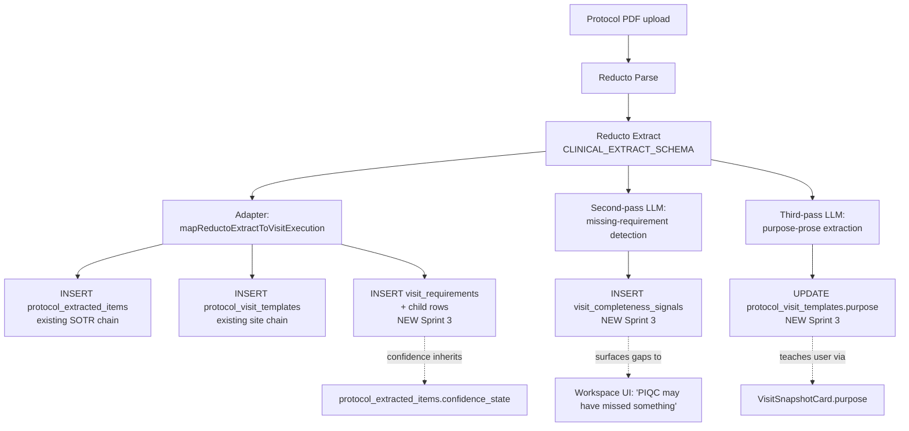

# Visit Execution Workspace — Parser Integration (Sprint 3 design doc)

**Status:** Design doc. Awaiting Roger's review before any ingest code is written.
**Sprint:** 3 (parser integration that populates the Sprint 2.5 canonical tables from real protocol PDFs).
**Branch:** `feat/visit-execution-parser-integration-doc`.
**Last updated:** 2026-05-26.

This doc is the parser-pipeline input to Roger's review. Sprint 3.5 will implement the ingest changes once this design is agreed on AND Sprint 2.5 (PR #123) has merged.

---

## 1. What changed between Sprint 2 and Sprint 3

Sprint 2's [canonical-schema.md](./canonical-schema.md) §5 sketched a parser-output mapping. Sprint 3 makes it concrete AND adds two new mandatory pipeline stages driven by founder feedback dated 2026-05-26:

| New requirement | Why it exists | Source |
|---|---|---|
| **Missing-requirement detection pass** | Partial coverage is product failure. A second-pass LLM compares Reducto's extraction against the protocol's visit section and flags gaps. | Founder completeness principle — [memory](../../.claude/projects/-Users-sixonelabsllc-Desktop-vendor-piqc/memory/feedback_vew_completeness_and_mastery.md) §1 |
| **Substantive purpose-prose extraction** | Anytime-mastery requires every element to teach. A placeholder purpose string fails the mastery test the moment a user opens the workspace. | Founder mastery principle — same memory file §2 |
| **Confidence propagation into `visit_requirements`** | Babaeipour 2026 keeps the human-in-the-loop; PIQC honors that by surfacing parser confidence per requirement. | [Research memory](../../.claude/projects/-Users-sixonelabsllc-Desktop-vendor-piqc/memory/research_vew_design_evidence.md), Babaeipour findings |

These are not Sprint 7 "quality" features. They are Sprint 3 critical-path because without them, the first real-data workspace ships fundamentally broken on the principles.

---

## 2. Pipeline overview



The existing pipeline today is **A → B → C → E1 → E2** (current main). Sprint 3 adds:
- **E3** — write the structured `visit_requirements` + child rows from Reducto's structured procedures
- **F → G** — the missing-requirement detection second pass
- **H → I** — the purpose-prose third pass

Each pass is a separate LLM call. The reasons for splitting:
- Different prompts optimize different objectives (extraction vs. coverage audit vs. narrative summary)
- A failure in one pass should not block the others — coverage detection failing shouldn't prevent the workspace from loading
- Splitting keeps individual prompts short enough for high accuracy (Babaeipour found shorter, scoped prompts outperformed long ones)

---

## 3. `CLINICAL_EXTRACT_SCHEMA` extension

Existing schema lives in `supabase/functions/ingest/index.ts`. The `schedule_of_events[]` entry currently produces `{visit_name, study_day, window_minus_days, window_plus_days, procedures: string[], schedule_variant, cross_references: [...]}`. The extension is **additive** — `procedures` keeps the existing flat-string shape for backward compatibility; a new sibling `procedures_structured` carries the rich data.

### 3.1 New per-visit fields

```jsonc
schedule_of_events: [{
  // Existing fields — unchanged:
  visit_name: string,
  study_day: number,
  window_minus_days: number,
  window_plus_days: number,
  procedures: string[],         // flat list, preserved for Sprint 1 mock-off fallback
  schedule_variant: string,
  cross_references: [...],      // unchanged

  // NEW Sprint 3 fields:
  visit_purpose: string,        // 1-3 sentences. SUBSTANTIVE. No placeholders.
  procedures_structured: [{
    label: string,              // human-readable procedure name
    phase: ExecutionPhase,      // see §3.3 for assignment rules
    classification: ItemClassification,  // see §3.3
    description: string | null, // optional richer text
    role_hint: string | null,   // "Phlebotomy nurse", "Pharmacist + Coordinator"
    soa_column: string | null,  // "V3"
    protocol_section: string | null,
    protocol_page: number | null,
    conditions: [{
      condition_text: string,
      consequence_text: string,
      source_section: string | null,
      source_page: number | null
    }],
    timing: {
      label: string,
      window_before_minutes: number | null,
      window_after_minutes: number | null,
      is_hard_constraint: boolean,
      source_section: string | null
    } | null,
    source_fields: [{
      field_label: string,
      field_type: 'text' | 'number' | 'boolean' | 'select' | 'date',
      units: string | null,
      normal_range: string | null,
      is_required: boolean
    }]
  }]
}]
```

### 3.2 Prompt engineering notes

The current ingest prompt is comprehensive about visit timing and cross-references. The extension prompt-stub should add (paraphrased):

> For each visit in `schedule_of_events`, populate `procedures_structured` with one entry per execution-ready requirement. Decompose multi-step SoA cells: a single "Labs" cell decomposes into separate entries for Hematology, Chemistry, etc. when the protocol's lab manual specifies them. Tag each procedure's phase based on its temporal position in the visit (`pre_visit`, `check_in`, `assessment`, `dosing`, `post_dose`, `safety_ae_conmed`, `close_out`). Tag classification based on the protocol's language — "must be done before dosing" or "primary endpoint" or "key safety assessment" are explicit signals.
>
> For `visit_purpose`, write 1-3 sentences that explain what the visit accomplishes in clinical terms — not "this is Day 1" but "Confirm pre-treatment baseline, dispense the first study drug supply, and observe the first dose under direct supervision." This text is read by a site coordinator who has never seen this protocol before. It must teach.
>
> If you cannot confidently extract a procedure's phase or classification, omit `procedures_structured` for that procedure rather than guessing. The downstream missing-requirement detection pass will surface the gap.

### 3.3 Phase + classification assignment

Two strategies, applied in order:

**Strategy A — explicit protocol language.** Reducto already extracts protocol text. The Extract prompt instructs the LLM to assign:
- `dosing` when procedure language matches "administer", "dispense study drug", "infuse", "IV bolus"
- `post_dose` when language matches "post-dose observation", "x minutes after dosing"
- `safety_ae_conmed` when language matches "adverse event review", "concomitant medications"
- `pre_visit` when language matches "site readiness", "kit availability"
- `check_in` when language matches "vital signs prior to", "registration", "informed consent reconfirmation"
- `close_out` when language matches "schedule next visit", "exit interview", "discharge"
- `assessment` as fallback for everything else

Classification follows similarly:
- `primary_endpoint` / `secondary_endpoint` when protocol text explicitly labels the endpoint
- `safety_critical` when protocol uses "safety-critical", "must be reviewed", "stopping rule"
- `conditional` when protocol uses "if", "when", "in subjects who"
- `if_applicable` when protocol uses "as applicable", "if clinically indicated"
- `required` as fallback

**Strategy B — confidence drop.** When the LLM cannot match either rule, it returns the procedure with `phase: null` and `classification: null`. The adapter then writes `phase = 'assessment'` and `classification = 'required'` as honest defaults AND flags the row with `confidence_state = 'low'` (inherited via `extracted_item_id`).

The defaults are the lowest-claim values — the safe call when uncertain.

---

## 4. Missing-requirement detection (the completeness pass)

The single most important new pipeline stage for product correctness.

### 4.1 Why it exists

The founder principle: *"PIQC fails if it does not include all the requirements from the protocol into the applicable visit the user is interacting with."* If Reducto misses a footnote saying "vital signs required 24 hours post-dose," the user gets an incomplete workspace and acts on it as if it were complete.

The mitigation: a **second-pass LLM that adversarially checks the extraction against the protocol section**.

### 4.2 The prompt

For each visit in the protocol:

> Here is the parser's extracted list of requirements for `${visit_name}` (Day `${study_day}`):
> ```
> ${procedures_structured.map(p => '- ' + p.label).join('\n')}
> ```
>
> Here is the relevant protocol text:
> ```
> ${visit_section_text + relevant_footnotes + cross_references}
> ```
>
> Identify any clinical or procedural requirement mentioned in the protocol text that is NOT in the parser's list. For each gap, return:
> - The requirement text (verbatim or close paraphrase)
> - The source location (section, page)
> - A confidence score (high / medium / low) for whether this is a real gap vs. ambiguity
> - The reason you think it was missed (e.g., "footnote-only", "implicit from body text", "cross-reference")
>
> Return an empty array if no gaps. Do NOT speculate — only flag requirements the protocol explicitly states.

### 4.3 Output handling

Each gap becomes a row in a new lightweight table (proposed in §8). The adapter does NOT auto-insert the gap as a `visit_requirements` row — that would defeat the human-in-the-loop principle. Instead, the gap is surfaced as a **visit-level completeness signal** in the UI.

### 4.4 Visit completeness signal surfaced in UI

Per the founder mastery + completeness principles, the workspace shows a per-visit confidence signal:

> ⚠ PIQC found 12 requirements for this visit. A coverage scan flagged 2 possible gaps —
> review section 7.4 to verify completeness.

This is the trust mechanism. The user knows PIQC is being honest about what it might have missed. **Crucially: the user is the one who decides whether to add the missing requirement** (via the `human_added` `requirement_origin` enum value in Sprint 2.5).

### 4.5 Failure mode

If the missing-requirement pass fails (LLM error, timeout, API down), the workspace still loads with whatever Sprint 3's first extraction produced. The completeness signal renders as "Coverage check unavailable" — not blocking, but honest about the gap in trust.

---

## 5. Purpose prose extraction (the mastery pass)

### 5.1 Why it exists

The founder mastery principle: *"PIQC succeeds is also training the site user or give the site user the feeling of anytime mastery of the protocol visit workflow."* A placeholder purpose string ("Per-protocol visit. Detailed execution requirements pending structured ingest extraction.") fails this on first view.

### 5.2 The prompt

Single-call per visit:

> Write a 1-3 sentence purpose statement for `${visit_name}` (Day `${study_day}`) based on this protocol text:
> ```
> ${visit_section_text}
> ```
>
> The reader is a site coordinator who has never seen this protocol before. Explain what the visit accomplishes in clinical terms — not "this is Day 1" but the actual clinical purpose. Do NOT name the sponsor or compound. Do NOT speculate beyond what the protocol states.
>
> Examples of good purpose statements:
> - "Confirm pre-treatment baseline, dispense the first study drug supply, and observe the first dose under direct supervision."
> - "Routine safety follow-up. Lab panel, AE review, and continued drug accountability."
> - "Mid-treatment efficacy assessment. PRO questionnaires alongside the usual safety battery."

The mock fixture in `src/lib/visit-execution/mockVisitWorkspace.ts` already shows the right shape and tone — this prompt aims to match it.

### 5.3 Storage

Sprint 3.5 adds `protocol_visit_templates.purpose TEXT` column. The adapter writes this. The `visit_execution_get_workspace` RPC selects it into the snapshot.

### 5.4 Failure mode

If the prompt fails, the visit's `purpose` column stays NULL. The workspace UI renders a fallback ("Per-protocol visit") — not a hallucinated guess.

---

## 6. Confidence propagation

The existing `protocol_extracted_items.confidence_state` enum (`'high' | 'medium' | 'low' | 'needs_review'`) is already populated by Reducto's per-field confidence. Sprint 3 wires this through:

1. Each `visit_requirements` row's `extracted_item_id` links to its source `protocol_extracted_items` row.
2. `visit_execution_get_workspace` RPC joins through `extracted_item_id` to pull the confidence state.
3. UI shows a per-item confidence badge when the state is `'low'` or `'needs_review'` (high/medium are quiet — the default trust).

This is **not** a new column on `visit_requirements`. The data lives where it always lived. The RPC surfaces it.

Founder mastery implication: a coordinator can see "PIQC was uncertain about this item" inline on the row, building protocol literacy over time — exactly the teaching surface the mastery principle calls for.

---

## 7. Re-ingest semantics

A protocol can be re-parsed (e.g., on amendment upload). The pipeline must NOT destroy human edits.

### 7.1 Rules

- `protocol_extracted_items.id` is preserved across re-ingest (upsert on `(document_id, field_path)` — existing SOTR pattern).
- `visit_requirements.id` is preserved across re-ingest. The upsert key is `(visit_template_id, ordinal)` — but the ordinal is fragile; see §7.2.
- `visit_requirements.derived_text` is overwritten by re-ingest **only when** `current_text IS NULL`. Human edits are sticky.
- `visit_requirements.review_status` is preserved unless the row is dropped entirely.
- `visit_requirement_human_edits` rows are NEVER deleted on re-ingest — append-only audit trail.
- `visit_conditional_rules`, `visit_timing_rules`, `visit_source_fields` are wiped + re-written from the parser output on re-ingest, since they're parser-derived and rarely human-edited. (Founder review item: confirm this is acceptable.)

### 7.2 Ordinal stability problem

`(visit_template_id, ordinal)` as the upsert key is fragile: a new requirement inserted between existing ones shifts every subsequent ordinal. Proposed fix: use a content fingerprint — `SHA256(visit_template_id || normalized(derived_text))` — as the dedup key during re-ingest. Falls back to ordinal for truly novel rows.

This is the kind of edge case that needs Roger's input. Surfacing here for review.

### 7.3 Requirement drift event

When `derived_text` would change but `current_text IS NOT NULL` (human edit blocks the overwrite), the adapter writes a row to a new table `visit_requirement_drift_log` (proposed in §8). This is the auditor's trail — "PIQC parsed something different but the human's edit took precedence."

---

## 8. Sprint 3.5 migration additions

These are deltas to the schema Sprint 2.5 establishes. Each is a new migration file (append-only rule):

```
supabase/migrations/
  20260615000000_visit_templates_add_purpose.sql
    ALTER TABLE protocol_visit_templates
      ADD COLUMN purpose TEXT,
      ADD COLUMN parser_confidence confidence_state;

  20260615000100_visit_completeness_signals_table.sql
    CREATE TABLE visit_completeness_signals (
      id UUID PRIMARY KEY DEFAULT gen_random_uuid(),
      visit_template_id UUID NOT NULL REFERENCES protocol_visit_templates(id) ON DELETE CASCADE,
      gap_text TEXT NOT NULL,
      source_section TEXT,
      source_page INTEGER,
      detection_confidence confidence_state NOT NULL,
      detection_reason TEXT,
      detected_at TIMESTAMPTZ NOT NULL DEFAULT NOW(),
      acknowledged_by UUID REFERENCES auth.users(id),
      acknowledged_at TIMESTAMPTZ,
      resolution TEXT  -- 'added_as_requirement' | 'dismissed_not_real' | 'pending'
    );
    -- RLS scoped through visit_template → protocol owner chain.

  20260615000200_visit_requirement_drift_log_table.sql
    CREATE TABLE visit_requirement_drift_log (
      id UUID PRIMARY KEY DEFAULT gen_random_uuid(),
      requirement_id UUID NOT NULL REFERENCES visit_requirements(id) ON DELETE CASCADE,
      parser_text_before TEXT NOT NULL,
      parser_text_after TEXT NOT NULL,
      current_text_preserved TEXT NOT NULL,
      reingest_run_id TEXT,
      detected_at TIMESTAMPTZ NOT NULL DEFAULT NOW()
    );
    -- RLS via visit_requirement → visit_template → protocol owner.
```

`visit_execution_get_workspace` RPC (created in Sprint 2.5) needs to be updated to:
- Read `purpose` from `protocol_visit_templates.purpose` (currently uses a fallback string)
- JOIN `visit_completeness_signals` for the active visit and include the gap list in the response
- Surface `extracted_item.confidence_state` per item

These are RPC body changes; the function signature stays the same.

---

## 9. Adapter + API rewiring

Once Sprint 2.5 + 3.5 land, the Sprint 1 adapter shifts from "thin passthrough" to "real reader."

### 9.1 `visitExecutionApi.ts`

```typescript
export async function fetchVisitExecutionWorkspaces(
  protocolId: string,
): Promise<Result<VisitExecutionWorkspace[]>> {
  if (isMockEnabled()) {
    return { ok: true, data: getMockVisitExecutionWorkspaces(protocolId) };
  }

  // OLD: const r = await fetchVisitTemplates(protocolId); return adapt(r.data);
  // NEW:
  const { data, error } = await supabase.rpc('visit_execution_get_workspace', {
    p_protocol_id: protocolId,
  });
  if (error) return fail('fetchVisitExecutionWorkspaces', error);
  return { ok: true, data: (data?.workspaces ?? []) as VisitExecutionWorkspace[] };
}
```

The RPC returns the exact shape `VisitExecutionWorkspace` defines. No adapter step needed at the read path.

### 9.2 `visitExecutionAdapter.ts`

The pure function survives but its role narrows: it becomes the **mock-mode-only** mapper for backward compatibility (and for tests against arbitrary `ProtocolVisitTemplate` inputs). In production, the real path bypasses it.

Alternative considered: delete the adapter entirely. Decision: keep it. It still serves a purpose for offline development, demo mode, and tests, and the maintenance cost is negligible.

### 9.3 New TypeScript type extensions

Sprint 3.5 adds these fields to existing types:

```typescript
interface VisitSnapshot {
  // ... existing fields
  parser_confidence: ConfidenceState | null;  // overall visit-level confidence
  completeness_signals: VisitCompletenessSignal[];  // gaps detected
}

interface VisitExecutionItem {
  // ... existing fields
  confidence_state: ConfidenceState;  // from linked protocol_extracted_items
}

interface VisitCompletenessSignal {
  gap_text: string;
  source_section: string | null;
  source_page: number | null;
  detection_confidence: ConfidenceState;
}
```

`ConfidenceState` already exists in `src/types/sotr/index.ts` — Sprint 3.5 imports it (acceptable cross-namespace type-only import; not a behavior dependency).

---

## 10. Decision debt deferred to Sprint 4+

| Deferred | Why | Picks up in |
|---|---|---|
| UI surface for `visit_completeness_signals` (the "PIQC may have missed something" affordance) | Sprint 3.5 ships the data; Sprint 4 (review/edit loop) is the natural sprint for the UI | Sprint 4 |
| UI for adding a requirement from a completeness signal | Same | Sprint 4 |
| Drift-log review UI | Niche; coordinator workflow needs validation first | Sprint 5 or 7 |
| Re-ingest fingerprint vs. ordinal — final algorithm | Roger reviews and decides | Sprint 3.5 |
| Role-filtered prompt variants (e.g., generate purpose for a nurse vs. coordinator) | Sprint 6 is when role-filtered views land | Sprint 6 |
| Amendment-version diff at the requirement level | Sprint 7 quality work | Sprint 7 |
| Cost / latency optimization on the 3-pass LLM pipeline | Ship correctness first; tune after | Post-Sprint-3.5 |

---

## 11. Three-pass cost / latency consideration

Each visit costs three LLM calls (extraction, missing-req detection, purpose prose). A 30-visit protocol = 90 calls. The current ingest pipeline is async (Reducto webhook → background processing), so latency is not a UX blocker — but cost matters.

Mitigation options (Sprint 3.5 if needed):
- Batch the purpose-prose pass into a single call covering multiple visits
- Cache by `(document_id, visit_name, study_day)` fingerprint — re-ingest with no protocol change reuses prior LLM output
- Skip the missing-req pass for visits with very high overall extraction confidence (e.g., when `parser_confidence = 'high'` and no `'low'` items)

These are tunable knobs, not blockers. The doc lands without committing to any specific optimization.

---

## 12. Review checklist (for Roger and the founder)

- [ ] Pipeline diagram in §2 covers all stages including the two new passes (missing-req detection, purpose prose)
- [ ] `CLINICAL_EXTRACT_SCHEMA` extension in §3 is additive (no breaking change to current `procedures: string[]` consumers)
- [ ] Phase + classification assignment heuristics in §3.3 use protocol language signals rather than guessing
- [ ] Missing-requirement detection prompt (§4.2) is adversarial — looks for what's missing, doesn't fabricate
- [ ] Missing-req gaps are NEVER auto-added as `visit_requirements` rows (human-in-the-loop preserved)
- [ ] Purpose-prose extraction (§5) writes substantive 1-3 sentence prose, not placeholder
- [ ] Re-ingest preserves `current_text` (human edits stick) — §7.1
- [ ] Re-ingest ordinal-vs-fingerprint problem named (§7.2) — open for Roger's call
- [ ] Sprint 3.5 migration list in §8 maps to the schema additions the doc requires
- [ ] RPC response shape (§9) matches `VisitExecutionWorkspace` exactly so the adapter step is bypassable
- [ ] Three-pass cost is acknowledged (§11) but not prematurely optimized

---

## 13. What this doc does NOT do

- Does not write any code or migration
- Does not modify the canonical schema (Sprint 2 / 2.5)
- Does not change Sprint 1 components
- Does not commit to specific Reducto Extract parameter values (the prompt-stub in §3.2 is paraphrased; Sprint 3.5 has the final tested prompt)
- Does not commit to specific LLM model choices (Sprint 3.5 picks; gpt-4o-mini is the precedent from `audit-summary` / `audit-mode-chat`)

---

## 14. References

- [`docs/visit-execution/canonical-schema.md`](./canonical-schema.md) — Sprint 2 schema design (merged in PR #121)
- [`supabase/migrations/20260601000600_visit_execution_rpcs.sql`](../../supabase/migrations/20260601000600_visit_execution_rpcs.sql) — Sprint 2.5 RPC (merging via PR #123)
- [`supabase/functions/ingest/index.ts`](../../supabase/functions/ingest/index.ts) — current `CLINICAL_EXTRACT_SCHEMA`
- [`supabase/migrations/20260508040000_sotr_draft_review_schema.sql`](../../supabase/migrations/20260508040000_sotr_draft_review_schema.sql) — `worksheet_review_events` precedent for the audit-log pattern
- [Memory: completeness + mastery feedback](../../.claude/projects/-Users-sixonelabsllc-Desktop-vendor-piqc/memory/feedback_vew_completeness_and_mastery.md)
- [Memory: research evidence base](../../.claude/projects/-Users-sixonelabsllc-Desktop-vendor-piqc/memory/research_vew_design_evidence.md)
